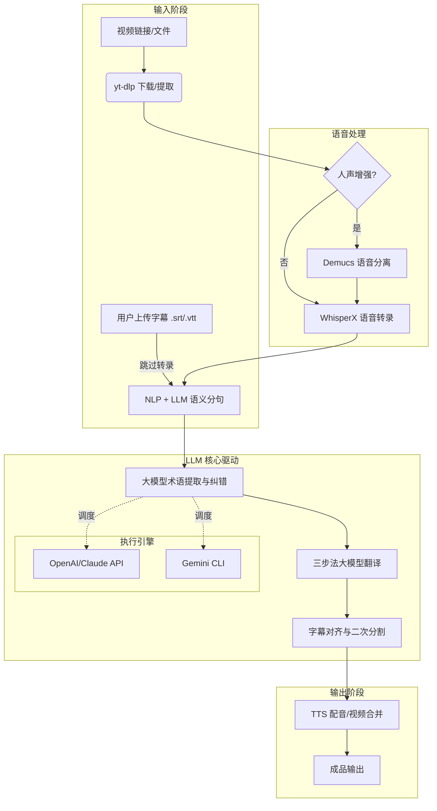

<div align="center">


# VideoLingo Q：连接世界，每一帧都动听

**全自动视频翻译、本地化与配音工具，打造 Netflix 级字幕体验**

</div>

## 🌟 项目概述

VideoLingo Q 是一款一体化的视频搬运神器，旨在生成高质量的 Netflix 级字幕。它不仅能消除生硬的机器翻译，还能通过大模型优化和高精度配音，跨越语言障碍，让全球优质内容触手可及。

**本项目相比于原版的深度优化：**
- **🚀 全程进度可视化**：在 ASR、翻译、分句、分割所有阶段引入实时进度条，精准显示 `(当前/总数)` 数量，掌控每一秒。
- **🤖 大模型术语纠错**：利用大模型智能识别 ASR 过程中的音近字错误，结合领域词汇表实现精准替换，完美同步时间戳。
- **📊 批处理全局监控**：新增批处理模式顶层进度条，直观查看“整体进度”与“当前视频细节”。
- **🎭 Edge TTS 语音试听**：内置最新的官方音色列表，支持在配置时实时试听预览。
- **💄 极致 UI/UX**：优化侧边栏布局，引入局部刷新机制，操作更顺滑，不丢失页面状态。

## 🎥 核心功能

- **🎙️ 高精度识别**：基于 WhisperX 的单词级时间轴识别，低幻觉，精准对齐。
- **📝 智能分割**：结合 NLP 和 AI 语义理解，自动将字幕分割为最适合阅读的单行格式。
- **📚 术语一致性**：支持自定义 + AI 提取术语，确保全篇专业名词翻译统一。
- **🔄 三步翻译法**：直译-反思-意译，三轮迭代，打磨出影视级的地道翻译。
- **🗣️ 一键配音**：支持 GPT-SoVITS, Azure, OpenAI, Edge-TTS 等多种顶级 TTS 方案。
- **🎨 现代三栏布局**：参考 OpenDesign 的专业设计，左侧配置、中间流程、右侧文件浏览，视野开阔，操作高效。
- **📦 批处理模式**：一键处理整个文件夹的视频，高效自动化。

## 🖥️ 界面设计结构

VideoLingo Q 采用了专为生产力设计的 **“汉堡工作站”** 布局，分为三个核心区域：

```mermaid
layout BT
    subgraph UI界面布局示意图
        direction LR
        L[<b>左侧：配置面板</b><br/>Tab页切换<br/>LLM/字幕/配音]
        C[<b>中间：主工作流</b><br/>Logo/欢迎语<br/>任务列表<br/>实时进度条]
        R[<b>右侧：文件管理</b><br/>编码对比<br/>Windows树形树]
    end
```

1. **左侧：功能配置区 (Sidebar Tabs)**
   - 采用标签页 (Tabs) 切换：**LLM**、**字幕**、**配音**。
   - 每一个选项卡都包裹在精致的圆角卡片中，并强化了输入框的边框识别度。
   - 修改配置实时保存，局部刷新侧边栏，不干扰中间任务。

2. **中间：核心工作流区 (Main Workflow)**
   - 清晰的 a、b、c 三阶段任务列表。
   - **动态状态反馈**：当前执行步骤**黄色高亮 (⏳)**，已完成步骤**绿色打勾 (✅)**。
   - **实时进度条**：集成在任务区域顶部的 Streamlit 原生进度条，精准显示 `(当前/总数)`。

3. **右侧：文件管理与分析区 (Right Panel)**
   - **视频编码对比**：实时利用 `ffprobe` 对比原始视频与产出视频的 Codec、像素格式、体积等关键指标。
   - **Windows 风格目录树**：交互式树形菜单，点击 `▶/▼` 箭头展开子目录，实时监控 `output` 文件夹的变化。

## 🏗️ 技术架构与核心原理

VideoLingo Q 不仅仅是一个简单的翻译工具，它通过一套复杂的流水线（Pipeline）确保了字幕的影视级品质。

### 1. 核心链路架构图


### 2. 灵活的执行路径
- **字幕上传模式 (Subtitle Bypass)**：
  如果您已经拥有高质量的官方字幕，可以在界面中直接上传。系统将**自动跳过**耗时的音频分离和 WhisperX 转录阶段，直接进入语义分句和翻译环节，大幅提升处理效率。
- **Gemini CLI 极致加速**：
  除了传统的 API 调用，本项目深度集成了 **Gemini CLI**。启用后，系统将通过命令行工具直接调用大模型，无需配置复杂的 API 代理或 Base URL，且在处理长文本分块时具有更强的稳定性和吞吐量。

### 3. 精妙的字幕处理技术
- **语义分句 (Split by Meaning)**：
  传统的工具按固定字数切分，容易打断语义。本项目利用 **SpaCy** 进行初步分词，再由 **LLM** 根据上下文含义进行“手术级”切分，确保每行字幕都是完整的意群。
- **三步翻译法 (Translate-Reflect-Adapt)**：
  1. **直译**：初步转换文字含义。
  2. **反思**：让模型指出直译中的僵硬、文化不贴切或术语不一致。
  3. **意译**：根据反思意见，打磨出符合电影质感的自然对白。
- **动态术语对齐 (LLM Vocab Correction)**：
  我们利用大模型的“听觉联想”能力。当识别出 `Claude Cowork` 为 `called cowork` 时，系统会将整段文本与领域词汇表发给模型，由其判断并修正识别错误，从而**在不破坏时间戳的前提下**大幅提升 ASR 准确率。

### 3. 字幕对齐与二次分割策略
为确保符合 Netflix 的单行字幕标准（单行不超 42 字符），系统采用了一种**递归对齐算法**：
- 如果翻译后的字幕过长，系统会重新调用分句提示词进行切分。
- 使用 **SequenceMatcher** 在字符级寻找最优切分点，确保中文翻译与原段落的时间轴完美契合。

## 🚀 快速开始

### 安装要求
- Python 3.10
- FFmpeg (必须安装)
- NVIDIA GPU (推荐，需安装 CUDA 12.6 与 CUDNN 9.3)

### 安装步骤
1. 克隆仓库：
```bash
git clone https://github.com/qxk2005/videolingo-q.git
cd videolingo-q
```

2. 创建并激活虚拟环境：

**Windows:**
```bash
python -m venv venv
.\venv\Scripts\activate
python install.py
```

**macOS/Linux:**
```bash
python3 -m venv venv
source venv/bin/activate
python3 install.py
```

3. 启动应用：
```bash
streamlit run st.py
```

## 🛠️ 进阶配置

### LLM 配置
VideoLingo Q 支持多种大模型方案：
- **Gemini CLI**：启用后可获得最精简的配置界面，一键调用。
- **OpenAI 兼容接口**：支持 Claude 3.5, GPT-4, DeepSeek V3 等主流模型。
- **配置文件管理**：支持保存多个 LLM 配置模板，一键切换。

### 配音设置
- **Edge TTS 预览**：在侧边栏选择音色后，点击 🔊 即可试听。
- **人声分离增强**：针对背景噪音大的视频，开启后可显著提升 ASR 准确率。

## 📦 批处理模式
将需要处理的视频放入 `batch/input` 文件夹，配置好 `batch/tasks_setting.xlsx`，运行 `batch/utils/batch_processor.py` 或双击 `OneKeyBatch.bat`。您将看到清晰的多层级进度监控：
- **顶层进度**：显示整体视频处理任务。
- **底层进度**：实时显示当前视频的转录、翻译、分割细节。

## 📄 开源协议
本项目基于 Apache 2.0 协议。特别感谢以下开源项目：
[whisperX](https://github.com/m-bain/whisperX), [yt-dlp](https://github.com/yt-dlp/yt-dlp), [Streamlit](https://streamlit.io/)

---
如果您觉得 VideoLingo Q 提升了您的效率，请给一个 ⭐️ 吧！
